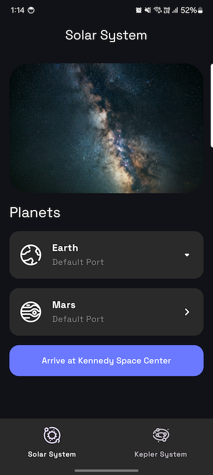
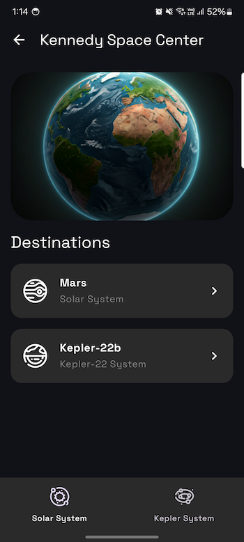
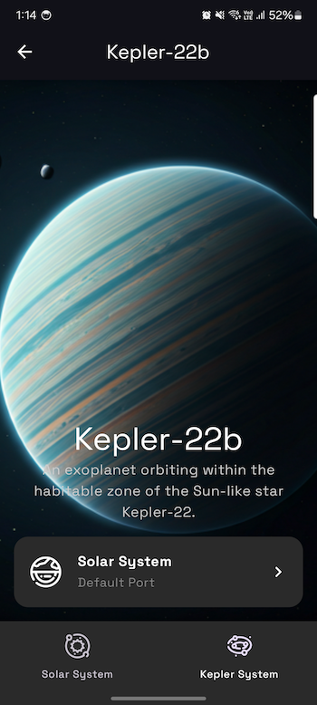

# Galaxy Navigation (Compose Multiplatform) — Type‑Safe Navigation Example

[](http://kotlinlang.org)


<table align="center">
  <tr>
    <td align="center">
      
    </td>
    <td align="center">
      
    </td>
    <td align="center">
      
    </td>
  </tr>
</table>

This repository is a minimal, practical example of type‑safe, deep‑linkable navigation with Compose Multiplatform (Android + iOS). It demonstrates how to:
- Define routes as serializable types instead of string paths
- Organize feature modules into nested navigation graphs
- Navigate with compile‑time safety using type‑checked arguments
- Handle deep links and external URIs
- Keep UI state and bottom navigation in sync with the back stack

## Project structure
- composeApp: Shared UI and app shell (KMP common, Android, iOS)
  - App.kt: App scaffold, bottom navigation, and back stack awareness
  - navigation/AppNavigation.kt: Root NavHost with feature graphs
- feature/solar: Solar System feature and its type‑safe navigation graph
  - navigation/SolarGraph.kt: Type‑safe routes and deep links for Solar
- feature/kepler22: Kepler‑22 feature and its type‑safe navigation graph
  - navigation/Kepler22Graph.kt: Type‑safe routes and deep links for Kepler‑22
- theme: Shared theming and resources
- iosApp: iOS entry point and wrapper

## Type‑safe navigation overview
This project uses androidx.navigation.compose with Kotlinx Serialization to define routes as Kotlin types. Each route is a @Serializable object or data class. Navigation graphs are declared with navigation<T>() and composable<T>() extensions so the compiler knows the route type and its arguments.

Example: Solar graph
```kotlin
// feature/solar/navigation/SolarGraph.kt
object SolarGraph {
    @Serializable data object ROUTE
    @Serializable data object SolarSystemScreen
    @Serializable data class EarthScreen(val spacePort: String)
    @Serializable data object MarsScreen
}

fun NavGraphBuilder.sunGraph(
    navController: NavController,
    onSelectKepler22System: () -> Unit
) {
    navigation<SolarGraph.ROUTE>(startDestination = SolarGraph.SolarSystemScreen) {
        composable<SolarGraph.SolarSystemScreen>(
            deepLinks = listOf(
                navDeepLink<SolarGraph.SolarSystemScreen>("galaxy://navigation/solar")
            )
        ) {
            SolarSystemScreen(
                onSelectEarth = { spacePort ->
                    navController.navigate(SolarGraph.EarthScreen(spacePort))
                },
                onSelectMars = { navController.navigate(SolarGraph.MarsScreen) }
            )
        }
        composable<SolarGraph.EarthScreen>(
            deepLinks = listOf(
                navDeepLink<SolarGraph.EarthScreen>("galaxy://navigation/earth")
            )
        ) {
            val args = it.toRoute<SolarGraph.EarthScreen>()
            EarthScreen(
                onSelectKeplerSystem = onSelectKepler22System,
                onSelectMars = { navController.navigate(SolarGraph.MarsScreen) }
            )
        }
        composable<SolarGraph.MarsScreen>(
            deepLinks = listOf(
                navDeepLink<SolarGraph.EarthScreen>("galaxy://navigation/mars")
            )
        ) {
            MarsScreen(
                onSelectKeplerSystem = onSelectKepler22System,
                onSelectEarth = { spacePort ->
                    navController.navigate(SolarGraph.EarthScreen(spacePort))
                }
            )
        }
    }
}
```

Key points:
- Each route is a @Serializable type. Arguments are regular properties (e.g., EarthScreen.spacePort: String).
- Navigate with navController.navigate(RouteType(...)) — no string building.
- Retrieve typed arguments with it.toRoute<RouteType>().
- Deep links are declared per composable with navDeepLink<RouteType>("scheme://host/path").

## Root navigation and feature graphs
The app’s NavHost wires the feature graphs and defines the start destination. Switching between top‑level graphs is also used by the bottom navigation.

```kotlin
// composeApp/src/commonMain/.../navigation/AppNavigation.kt
@Composable
fun AppNavigation(modifier: Modifier = Modifier, navController: NavHostController) {
    NavHost(
        modifier = modifier,
        navController = navController,
        startDestination = SolarGraph.ROUTE,
        contentAlignment = Alignment.Center
    ) {
        sunGraph(
            navController = navController,
            onSelectKepler22System = { navController.navigate(Kepler22Graph.ROUTE) }
        )
        kepler22Graph(
            navController = navController,
            onSelectSolarSystem = { navController.navigate(SolarGraph.ROUTE) }
        )
    }
}
```

The scaffold in App.kt reads the back stack to:
- Set the toolbar title based on current route type
- Show/hide the back button on top‑level destinations
- Keep bottom navigation selection in sync with the current graph

```kotlin
// composeApp/src/commonMain/.../App.kt (excerpt)
val bottomNavItem = remember(currentDestination) {
    currentDestination?.destination?.run {
        when {
            hierarchy.any { it.hasRoute<SolarGraph.ROUTE>() } -> BottomNavItem.SolarSystem
            hierarchy.any { it.hasRoute<Kepler22Graph.ROUTE>() } -> BottomNavItem.Kepler22System
            else -> null
        }
    }
}
```

## External URI handling and deep links
Deep links like galaxy://navigation/solar, galaxy://navigation/earth, galaxy://navigation/mars, galaxy://navigation/kepler22, and galaxy://navigation/kepler22b are supported at the composable level. The app can also react to external URIs at runtime and navigate safely:

```kotlin
// composeApp/src/commonMain/.../App.kt (excerpt)
LaunchedEffect(currentState) {
    if (currentState == Lifecycle.State.RESUMED) {
        launch {
            ExternalUriHandler.uriFlow.collect { uri ->
                try {
                    navController.navigate(NavUri(uri))
                } catch (e: Exception) {
                    // show a snackbar with error
                }
            }
        }
    }
}
```

## Android deep links
On Android, the app declares an intent-filter to receive galaxy://navigation/... links and forwards them into the shared navigation.

1) Manifest setup (composeApp module)
The main activity registers a VIEW intent-filter for the custom scheme and host:

```xml
<!-- composeApp/src/androidMain/AndroidManifest.xml -->
<activity
    android:name=".MainActivity"
    android:exported="true">
    <intent-filter>
        <action android:name="android.intent.action.MAIN" />
        <category android:name="android.intent.category.LAUNCHER" />
    </intent-filter>

    <!-- Deep link support -->
    <intent-filter>
        <action android:name="android.intent.action.VIEW" />
        <category android:name="android.intent.category.DEFAULT" />
        <category android:name="android.intent.category.BROWSABLE" />
        <data android:scheme="galaxy" android:host="navigation" />
    </intent-filter>
</activity>
```

Notes
- You can add android:path or android:pathPattern if you want to restrict to specific paths. With only scheme+host, all galaxy://navigation/... links are accepted.
- The project uses type-safe deep links per screen; the Compose Navigation layer then resolves the path and arguments.

2) Activity handling (no extra code required)
Navigation-Compose will create the initial back stack from the deep link when the activity is launched via the intent-filter. Additionally, if your app is already running and receives a deep link, you can forward it to the shared handler (optional pattern):

```kotlin
// Example (not strictly required for cold starts when started from deep link)
override fun onNewIntent(intent: Intent) {
    super.onNewIntent(intent)
    if (intent.action == Intent.ACTION_VIEW && intent.data != null) {
        ExternalUriHandler.onNewUri(intent.dataString ?: return)
    }
}
```

3) Compose side: observe and navigate
As documented below, App.kt collects ExternalUriHandler.uriFlow and calls navController.navigate(NavUri(uri)). This covers runtime links delivered while the app is in foreground.

4) Test deep links on Android
- Start the app via a deep link:
  - adb shell am start -a android.intent.action.VIEW -d "galaxy://navigation/solar"
  - adb shell am start -a android.intent.action.VIEW -d "galaxy://navigation/earth?spacePort=Cape%20Canaveral"
  - adb shell am start -a android.intent.action.VIEW -d "galaxy://navigation/mars"
  - adb shell am start -a android.intent.action.VIEW -d "galaxy://navigation/kepler22"
  - adb shell am start -a android.intent.action.VIEW -d "galaxy://navigation/kepler22b"
- Or tap such links from Chrome or other apps on the device/emulator.

## iOS deep links
On iOS, deep links are delivered via custom URL schemes (configured in Info.plist) and forwarded at runtime to the shared ExternalUriHandler, which the Compose layer observes and then navigates using NavUri.

1) Configure URL scheme (Info.plist)
The project already registers the custom scheme galaxy:

```xml
<!-- iosApp/iosApp/Info.plist -->
<key>CFBundleURLTypes</key>
<array>
  <dict>
    <key>CFBundleTypeRole</key>
    <string>Editor</string>
    <key>CFBundleURLName</key>
    <string>com.codescape.GalaxyNavigation</string>
    <key>CFBundleURLSchemes</key>
    <array>
      <string>galaxy</string>
    </array>
  </dict>
</array>
```

2) Handle incoming URLs in Swift and forward to Kotlin
There are two equivalent ways shown in the project. The simplest uses SwiftUI’s .onOpenURL on the window’s root view:

```swift
// iosApp/iosApp/iOSApp.swift
import SwiftUI
import ComposeApp

@main
struct iOSApp: App {
    var body: some Scene {
        WindowGroup {
            ContentView().onOpenURL { url in
                print("DEEPLINK \(url)")
                ExternalUriHandler.shared.onNewUri(uri: url.absoluteString)
            }
        }
    }
}
```

Alternatively, you can handle URLs in a UIApplicationDelegate if you prefer the classic lifecycle (commented in AppDelegate.swift):

```swift
// iosApp/iosApp/AppDelegate.swift (example)
@MainActor
class AppDelegate: NSObject, UIApplicationDelegate {
    func application(_ application: UIApplication, open url: URL, options: [UIApplication.OpenURLOptionsKey : Any] = [:]) -> Bool {
        ExternalUriHandler.shared.onNewUri(uri: url.absoluteString)
        return true
    }
}

// And wire it in iOSApp.swift:
@UIApplicationDelegateAdaptor(AppDelegate.self) var delegate
```

3) Compose side: observe and navigate
The common App.kt collects ExternalUriHandler.uriFlow when the app is in RESUMED state and navigates with NavUri:

```kotlin
// composeApp/src/commonMain/.../App.kt (excerpt)
LaunchedEffect(currentState) {
    if (currentState == Lifecycle.State.RESUMED) {
        launch {
            ExternalUriHandler.uriFlow.collect { uri ->
                try {
                    navController.navigate(NavUri(uri))
                } catch (e: Exception) {
                    // show a snackbar with error
                }
            }
        }
    }
}
```

4) Test deep links on iOS Simulator
- With the app running, run in Terminal:
  - xcrun simctl openurl booted "galaxy://navigation/solar"
  - xcrun simctl openurl booted "galaxy://navigation/earth?spacePort=Cape%20Canaveral"
  - xcrun simctl openurl booted "galaxy://navigation/mars"
  - xcrun simctl openurl booted "galaxy://navigation/kepler22"
  - xcrun simctl openurl booted "galaxy://navigation/kepler22b"
- Or click such links in Notes/Safari on the simulator.

Notes
- Use url.absoluteString to preserve both path and query parameters for typed argument parsing.
- If you need to buffer links before Compose is ready, you can gate collection using lifecycle or add a simple readiness flag in ExternalUriHandler (commented in the code as an example).

## Running the project
- Android: Use the IDE run configuration or run: ./gradlew :composeApp:assembleDebug
- iOS: Open iosApp in Xcode or use the IDE’s run configuration.

Requirements:
- JDK 17+
- Android Studio or IntelliJ IDEA with Kotlin Multiplatform plugin
- Xcode for iOS builds

## Extending navigation
To add a new screen with arguments in a feature graph:
1. Declare a @Serializable route type (object or data class for args).
2. Add a composable<RouteType> to the graph. Provide optional navDeepLink<RouteType>("your-scheme://...").
3. Navigate using navController.navigate(RouteType(args...)).
4. Read arguments via backStackEntry.toRoute<RouteType>().

To add a new top‑level graph:
- Create a Graph object with @Serializable ROUTE.
- Register it inside the root NavHost and update bottom navigation selection if needed.

## UI
UI design is done with Google Stitch: https://stitch.withgoogle.com/

## Icons
Icons are from Reshot Space Line Icon Set: https://www.reshot.com/free-svg-icons/item/space-line-icon-set-7YDXQBCTRH/